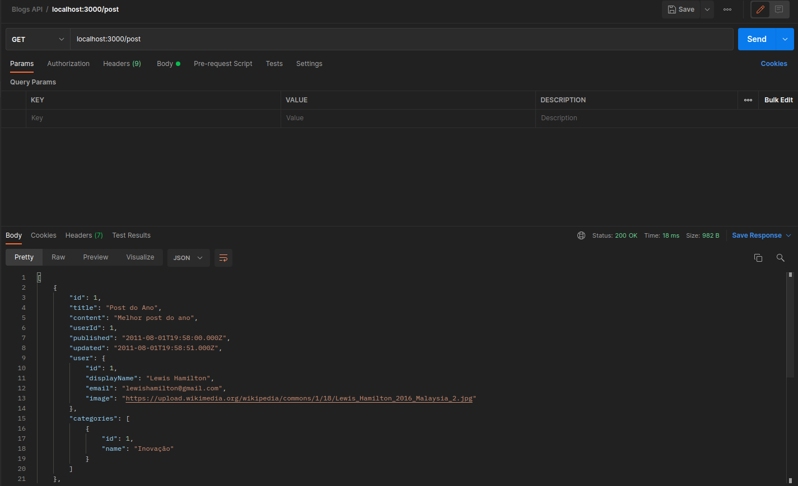

A ideia do projeto é simular o funcionamento do backend de um blog através da implementação de uma aplicação em Node.js usando o pacote sequelize para fazer um CRUD de posts. Para a realização do projeto, algumas metas deviam ser batidas e essas são descritas abaixo:

#### 1 - A aplicação deve ter o endpoint POST `/user`

Aqui deve ser possível criar um usuário, caso o mesmo não exista. Para isso deve ser enviado à aplicação um objeto JSON contendo:

- DisplayName: o nome que aparecerá para o usuário cadastrado;
- Email: Cada email somente poderá ser cadastrado na plataforma uma vez;
- Password: Deverá conter a senha que o usuário irá utilizar para fazer Login na plataforma, esta deverá conter no mínimo 6 carácteres.

Caso o email já tenha sido cadastrado uma mensagem de erro deverá informar que o usuário já existe.

Realizado o cadastro com sucesso a aplicação deverá devolver um token JWT que garantirá o acesso às funcionalidades da aplicação.

#### 2 - A aplicação deve ter o endpoint POST `/login`

A aplicação deve possuir uma página de login caso o usuário já seja cadastrado. Nessa página um objeto JSON contendo email e senha deve ser enviado à aplicação. Caso seja informado dados válidos a aplicação devolverá um token de acesso, caso contrário ela devolverá um erro informando que os dados inseridos são inválidos.

### 3 - A aplicação deve ter o endpoint GET `/user`

A aplicação deve ser capaz de listar todos os usuários cadastrados, para isso será necessário informar à aplicação um token de acesso válido, a partir desse ponto todas as rotas necessitam de um token de acesso.

### 4 - A aplicação deve ter o endpoint GET `/user/:id`

Além de listar todos os usuários a aplicação deve ser capaz de devolver cada usuário individualmente, para isso basta informar na url da requisição o id do usuário desejado.
### 5 - A aplicação deve ter o endpoint POST `/categories`

Quem já acessou um blog ou um site de compras sabe que cada item de uma aplicação possuí uma categoria para possibilitar filtrar itens semelhantes. A aplicação torna necessária a habilidade de criar categorias novas através desse endpoint.

Para criar uma categoria é necessário informar o nome da categoria que deseja criar.

### 6 - A aplicação deve ter o endpoint GET `/categories`

A aplicação deve ser capaz de listar todas as categorias criadas até o momento.

### 7 - A aplicação deve ter o endpoint POST `/post`

O usuário pode criar um post novo no blog, para isso ele deverá enviar um objeto JSON em sua requisição contendo:

title: titulo de sua postagem;
content: conteúdo da sua postagem;
categoryIds: o número de identificação de cada uma das categorias em que seu post se enquadra. Observação, todos os ids devem ser ids válidos.

### 8 - A aplicação deve ter o endpoint GET `/post`

A aplicação deve ser capaz de mostrar todos as postagens criadas até o momento. O retorno deve conter as informações abaixo:

### 9 - A aplicação deve ter o endpoint GET `post/:id`

Similar ao item anterior, se for requisitado com o id correto de um post, a aplicação deverá devolver todas as informações referentes aquela postagem.
### 10 - A aplicação deve ter o endpoint PUT `/post/:id`

A aplicação deve ser capaz de deixar o usuário atualizar uma postagem sua. Para isso será verificado se o token JWT condiz com o id de usuário do criador da postagem.

### 11 - A aplicação deve ter o endpoint DELETE `post/:id`

O usuário deve ser capaz de deletar suas postagens através do id da mesma. Será verificado se o usuário é dono daquela postagem.

### 12 - A aplicação deve ter o endpoint DELETE `/user/me`

O usuário deve ser capaz de remover sua conta do banco de dados da aplicação.

### 13 - A aplicação deve ter o endpoint GET `post/search?q=:searchTerm`

Deve ser possível pesquisar uma publicação através de seu conteúdo e/ou seu título.
